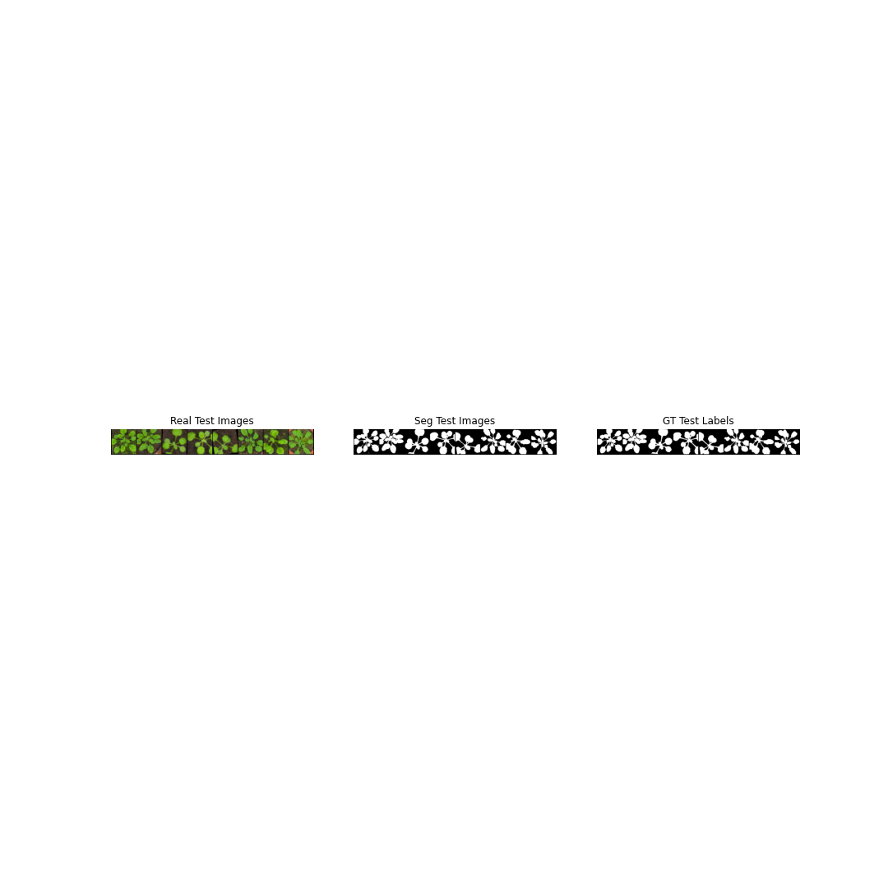

# Segmentation_Unet_Plants
Repository for semantic segmentation of plants using UNet architecture. In this repo, a segmentation model for a plant dataset has been implemented. The segmentation model has been implemented using a famous neural network architecture UNet. In this implementation, the UNet architecture is not totally symmetric (number of encoding blocks equal to decoding blocks) and so, in that way it can also be considered as a Fully Convolutional network (FCN) architecture. 

# Prerequisites
Python 3.6
Pip package manager

# Usage
1. Download or clone the zip folder 
2. cd to the extracted folder 'Segmentation_Unet_Plants'
3. Add the Python requirements: pip3 install -r requirements.txt
4. cd to folder 'Code' in the 'Segmentation_Unet_Plants' folder
5. Run the script main.py to train the model on the given dataset. You can run the script main.py at the terminal by running the following command:
python main.py --images_dir '../Data/images' --labels_dir '../Data/labels' --results_dir '../Results'
Note that in the above command relative paths are given but it is always better to specify absolute path to the image, label and results dir.

# Dataset
The dataset used is very small with only about 160 images. The ground truth labels are also provided for each image. Note that we are trying to design a semantic segmentation model, not an instance segmentation model. However, the labels are for instance segmentation. So, we need to binarize the labels before we train the model. This binarization is done in the get_item function in the MyDataset Class in the dataset_utils.py file. 

It could be observed from the dataset that there were 2 kinds of plants, one kind of plants, where the leaves were more symmetric and consistent in shape, there were about 112 images of these kind. The rest 48 images were of different kind of plant where the leaves were little unsymmetrical. The dataset was shuffled using both kind of plants and splitting
it into training, validation and testing split of 80,10, and 10 percent respectively.

# Data Augmentation
Considering such a small dataset of only 160 images, using data augmentation was inevitable. The following data augmentations were applied for the dataset: a) Horizontal Flip b) Vertical Flip c) Rotation from -10 to 10. Data augmentation was performed using multiple methods listed below.
## Augmentation using Image Processing Library
In this method, each image is augmented using the above augmentations and stored on the system. So, basically increasing the size of the dataset from 160 to 1120. This kind of augmentation is a static transformation where there is less randomness.
## Augmentation using the Pytorch framework
In this augmentation method, the images are augmented on the fly and not stored in the system as in the above method. So, basically, each image in this method is augmented on the fly, which provides some kind of randomness to the data augmentation.

# Loss Function
Weighted combination of binary cross entropy loss and the Jaccard (IOU) loss has been used as the loss function.

# Performance Metrics
The performance metrics used for evaluating the model are Jaccard Index ( also know as Intersection over Union (IOU) and Dice coefficient (also known as F1-score). Jaccard index is the area of overlap between the predicted segmentation and the ground truth divided by the area of union between the predicted segmentation and the ground truth. It is a very common metric used for segmentation applications. Similarly, Dice coefficient is twice the the area of overlap divided by the total number of pixels in both images. 

# Performance Evaluation
There was no state-of-the comparison, however there was a lot of hyperparameter tuning performed, the results of which are given in Tables below.From the experiments and hyper parameter tuning, I would like to mention that a batch size of 8 with Adam optimizer and a linear learning rate scheduler with starting learning rate of 0.01 would be the best combination of hyper parameters for this UNet model using the given dataset.

### Table 1: DICE and IOU VALUES for different LEARNING RATES at a BATCH SIZE OF 16, with SGD OPTIMIZATION and MOMENTUM OF 0.9
| Learning Rate | DiceCoeff-Val (%) | IOU-Val (%) | DiceCoeff-Val (%) | IOU-Test (%) |
| :-----------: |:-------------:    | :-----:     |   :-----:         |  :-----: |
|   0.0001      |  88.01           |   78.35      |     87.5          | 78.11 
|   0.0002      |  93.12           |   86.98      |      92.82        | 86.71
|   0.0003      |  95.01           |   90.04      |      94.71        | 89.98
|   0.0004      |  94.98           |   89.89      |      94.44        | 89.55
|   0.0005      |  95.38           |   91.18      |      94.86        | 90.31
|   0.0006      |  95.64           |   91.71      |      95.88        | 92.17
|   0.0007      |  95.71           |   91.82      |      96.3         |  93
|   0.0008      |  96.15           |   92.61      |      95.85        | 92.07
|   0.0009      |  95.76           |   91.93      |      96.42        | 93.12
|   0.001       |  96.2           |   92.72       |      96.21        | 92.73
|   0.002       |  95.74           |   91.89      |      96.72        | 93.67

### Table 2: DICE and IOU values for different BATCH SIZES at a LEARNING RATE of 0.001 with SGD OPTIMIZATION and MOMENTUM OF 0.9
| BatchSize | DiceCoeff-Val (%) | IOU-Val (%) | DiceCoeff-Val (%) | IOU-Test (%) |
| :-----------: |:-------------:    | :-----:     |   :-----:         |  :-----: |
|   16      |  96.2           |   92.72      |     96.21          | 92.73 
|   8      |  97.03           |   94.23      |      96.34        | 93
|   4      |  97.56           |   95.24      |      95.84        | 92.1

### Table 3: DICE and IOU values for different LR SCHEDULER along with the starting LEARNING RATE for BATCH SIZE of 8 with SGD OPTIMIZATION and MOMENTUM of 0.9
| LRscheduler − startLR | DiceCoeff-Val (%) | IOU-Val (%) | DiceCoeff-Val (%) | IOU-Test (%) |
| :-----------:         |:-------------:    | :-----:     |   :-----:         |  :-----: |
|   Step LR - 0.001      |  93.78           |   88.44      |     96.13          | 92.56 
| Linear - 0.001      |  96.71           |   93.64      |      95.66        | 91.77
|  Linear - 0.01     |  97.56           |   95.24      |      95.84        | 92.1
| Exponential - 0.1|   96.43            |  93.98       |      95.76        | 92.76

### Table 4: DICE and IOU values for different OPTIMIZERS along with the starting LINEAR SCHEDULER at a starting RATE of 0.01 for BATCH SIZE OF 8
| Optimizer | DiceCoeff-Val (%) | IOU-Val (%) | DiceCoeff-Val (%) | IOU-Test (%) |
| :-----------:         |:-------------:    | :-----:     |   :-----:         |  :-----: |
|   ADAM     |  97.25           |   94.66      |     97.28          | 94.72 
| SGD      |  97.2           |   93.8      |      96.99        | 94.19

### Table 5: DICE and IOU values for different AUGMENTATION METHODS with ADAM OPTIMIZER and starting LINEAR SCHEDULER at a starting RATE of 0.01 
| Optimizer | DiceCoeff-Val (%) | IOU-Val (%) | DiceCoeff-Val (%) | IOU-Test (%) |
| :-----------:         |:-------------:    | :-----:     |   :-----:         |  :-----: |
|   PYTORCH (On the Fly)   |  97.25           |   94.66      |     97.28          | 94.72 
| STATIC      |  97.19           |   94.57      |      96.44        | 93.18

### Segmentation on Test Images

Given below are some of the test images along with the ground truth and segmentation results. These images are given in the Results Folder. There are two pretrained models provided in the Result Folder. These are the models using the best combination of hyper parameters (batch size of 8 with Adam optimizer and a linear learning rate scheduler with starting learning rate of 0.01).

